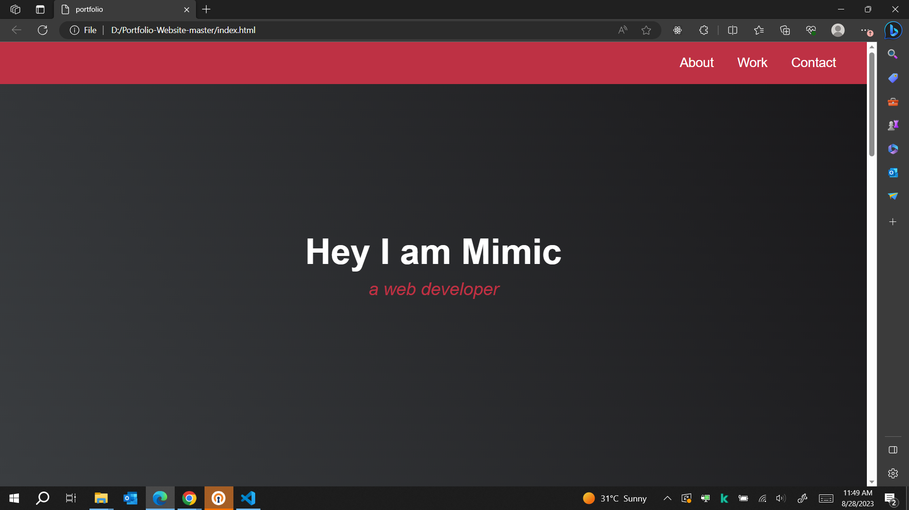

# Portfolio

This is a simple HTML and CSS portfolio template showcasing a web developer's projects and contact information.

## Sections

- **About**
  - Introduction to the developer, named Mimic, as a web developer.
- **Work**
  - Displays a selection of projects completed by the developer.
- **Contact**
  - Provides various contact options, including social media links, email, and phone.

## Projects

- **Tribute Page**
  
- **Random Quote Machine**
  
- **JavaScript Calculator**
  
- **Map Data Across the Globe**
  
- **Wikipedia Viewer**
  
- **Tic Tac Toe Game**
  

## Contact

You can connect with Mimic through various channels:

- [Facebook](#)
- [GitHub](#)
- [Twitter](#)
- Email: [Send a mail](#)
- Phone: [Call me](#)

**Note:** This portfolio is for demonstration purposes only. The projects and contact details provided are not real.

Created for [freeCodeCamp](#) by Mimic.
